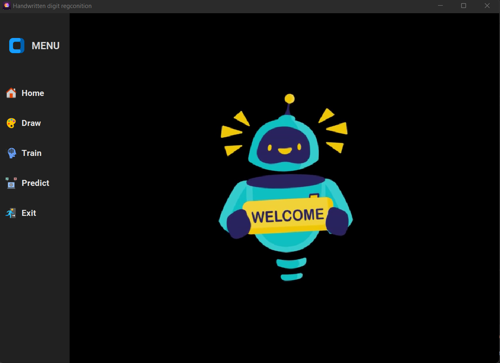

# Handwritten-Digits-Classification-Application-in-Python

## Libraries:
- GUI: matplotlib, seaborn, customtkinter, tkinter
- Data processing: Numpy, Pandas, OpenCV
- Modelling: Scikit-learn and Tensorflow

__NOTE__: Extract train.rar to data/mnist and change src/config.py for personal uses that match your computer

